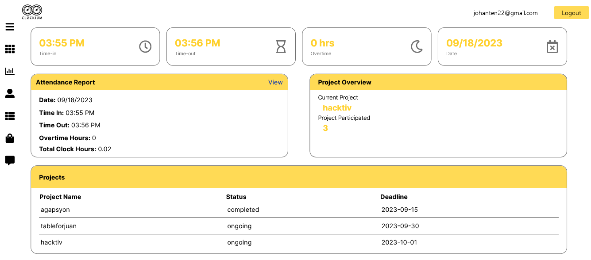

# Clockium



## Getting Started

To get a local copy up and running, follow these steps. 

### Prerequisites

Before you begin, ensure you have installed the latest version of:

- Node.js and npm
- Git

### Installation

1. Clone the repository:
   ```bash
   git clone https://github.com/prince-bojji/hacktiv.git
   
2. Navigate to the project directory:
   ```bash
    cd hacktiv
   
3. Install the project dependencies:
   ```bash
    npm install
   
4. Run API
   ```bash
    json-server --watch src/Data/db.json --port 
    
5. Start the development server:
   ```bash
    npm run dev

Now you should be able to see the project running at localhost:3000. 

## Additional Information
1. We haven't implemented a registration feature since we assume that accounts will be provided by the company. Currently, there are only two users available for testing:

        User A:
            Email: johanten22@gmail.com
            Password: johanten
   
        User B:
            Email: test@gmail.com
            Password: test
            Since there is no admin panel, you can add users directly in the db.json.

3. After logging in to your account, you may notice that some information is empty. This occurs because you haven't yet clocked in or out. The information will be populated immediately once your time in and out, and then click save to confirm your attendance.

4. When enlisting a new project in the project list, you have the option to add a specific collaborator. In this scenario, with only two users available for testing, whether you're using ```johanten22@gmail.com``` or ```test@gmail.com```, you can add the other as a contributor. The same applies when editing a project; you only need to enter the project name and any other details you wish to modify.

## Contributing

1. Fork the Project
2. Create your Feature Branch (`git checkout -b feature/YourFeature`)
3. Commit your Changes (`git commit -m 'Add some feature'`)
4. Push to the Branch (`git push origin feature/YourFeature`)
5. Open a Pull Request

## Contributors:
| Task  | Front-end | Status | Back-end | Status |
| ------------- | ------------- |  ------------- | ------------- | ------------- |
| Login Page  | Japay, Urriko  | Completed | Batang, Jehan | Completed |    
| Dashboard  | Mejia, Juan | Completed | Batang, Jehan | Completed |
| Time Logs  | Maramag, Cheyenne | Completed | Batang, Jehan | Completed |
| Employee Request | Flores, Andrea Nicole | Completed | Tolentino, John Cedrick | Ongoing |
| Project Enlisting  | Hamor, Mary Grizelle | Completed | Batang, Jehan | Completed |
| File System  | Flores, Andrea Nicole | Completed | Tolentino, John Cedrick | Ongoing |
| Freedom Board | Nablo, Kenshin |Completed | Batang, Jehan |Completed |

